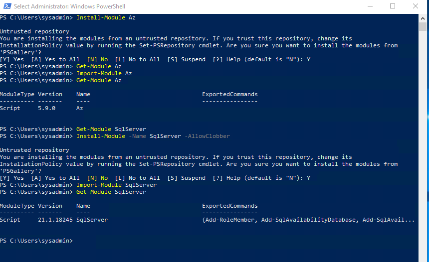
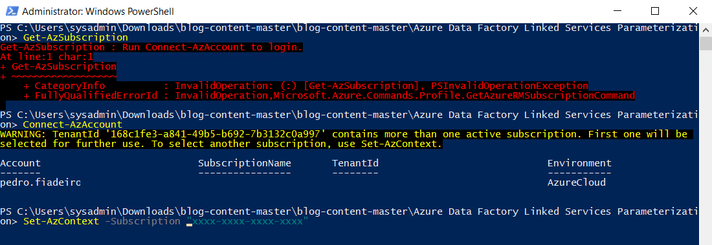
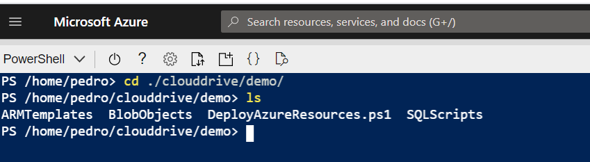

## PowerShell Script

The script *DeployAzureResources.ps1* will help you deploy the required resources to follow the blog post available [here](https://www.pedrofiadeiro.com/azure-data-factory-policies/azure-data-factory-linked-services-parameterization).

The following actions will be executed by the script:
- 2 SQL Servers with a database each will be created 
- Both will have firewall rules to allow Azure services to connect and your own ip address assuming you specify it correctly
- On the source database, a table will be created and a few records inserted. On the target database, a table will be created with no records
- 2 storage accounts, each with a container, will be created. A file will be uploaded to the source storage account
- A Data Factory Instance will be created. 2 linked services will also be added, one for Azure SQL Database and another for Data Lake Gen2
- Permissions will be assigned to the ADF instance to access both storage accounts

## Requirements

In order to run this script you need the PowerShell modules **Az** and **SqlServer**. If you don't have them installed you can do it by executing the instructions seen in the image below.



You'll also need the Azure CLI which can be installed by following the instructions [here](https://docs.microsoft.com/en-us/cli/azure/install-azure-cli).

## Execution

Before executing the script, in the file **azuredeploy.parameters.json**, the only parameter that **MUST BE** changed is **clientIpValue** where you should input the IP address you're currently using. This is required in order to connect to the databases and create the objects and if you don't change this value and leave the default value (*xxx.xxx.xxx.xxx*), the deployment will fail.

You can change the value of the other parameters but it's not required. Most objects such as the SQL Server, ADF instance and storage accounts will use the parameter value and the resource group unique id to create an unique name. I suggest not altering the value of the other parameters.

Before executing the script, you need to make sure you're connected to your Azure account. Run the command **Get-AzSubscription** and if you get an error message such as the one seen in the image below, run the command **Connect-AzAccount** and provide the credentials to connect. Finally, if you have multiple subscriptions associated to your account, you can use the command **Set-AzContext** to define the subscription where you'll be deploying these resources.

  

To execute the PowerShell script just run (make sure you set your own password and the correct resource group name, the values below are just illustrative):

```PowerShell
.\DeployAzureResources.ps1 -SqlServerPassword 'YourVer1S3cur3Passw0rd' -RgName 'rg-name'
```

Take into account that the SQL Server Password  must be between 8 to 128 characters and include three of the following categories: English uppercase letters, English lowercase letters, numbers and non-alphanumeric characters. It cannot contain all or part of the login name.

After executing the script you'll have all objects required to follow the steps described in the blog post.

## Alternative Option

If you prefer not to install the required PowerShell modules and az cli on your machine, you can simply use the Azure Cloud Shell to run this script. Simply upload all the required folders and files into your clouddrive directory and run the script directly from there.


